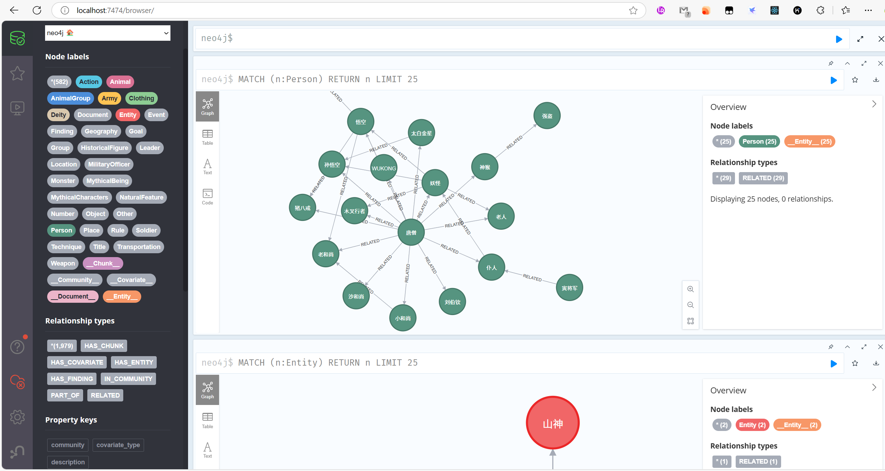
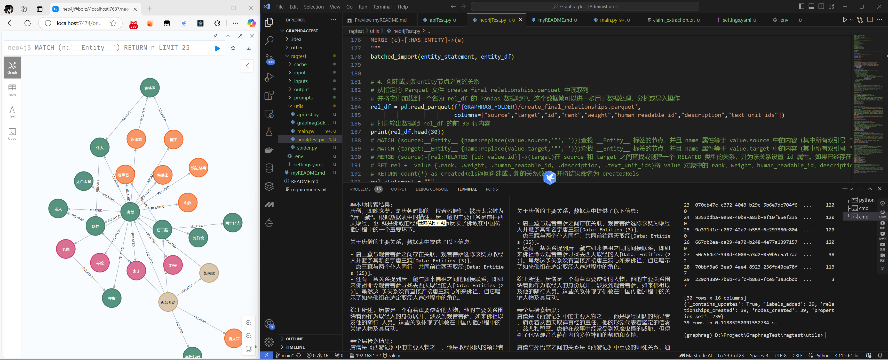

# graphrag的demo

## 效果



## 如何运行

### step1 使用docker安装oneapi并配置渠道令牌
oneapi是OpenAI接口的管理、分发系统
```bash
docker run --name one-api -d --restart always -p 3000:3000 -e TZ=Asia/Shanghai -v /opt/one-api/data:/data justsong/one-api:v0.6.8
```

配置通义千问的渠道，配置令牌
生成one api的令牌


### step2 使用docker安装neo4j
```bash
sudo mkdir -p /opt/neo4j/data
sudo mkdir -p /opt/neo4j/logs
sudo mkdir -p /opt/neo4j/conf
sudo mkdir -p /opt/neo4j/import
sudo mkdir -p /opt/neo4j/plugins
sudo docker run -d --name container_name -p 7474:7474 -p 7687:7687 -v /opt/neo4j/data:/data -v /opt/neo4j/logs:/logs -v /opt/neo4j/conf:/var/lib/neo4j/conf -v /opt/neo4j/plugins:/var/lib/neo4j/plugins -v /opt/neo4j/import:/var/lib/neo4j/import -e NEO4J_AUTH=neo4j/12345678 -e NEO4J_dbms_security_procedures_unrestricted="apoc.*" -e NEO4J_dbms_security_procedures_allowlist="apoc.*" -e NEO4JLABS_PLUGINS='["apoc"]' neo4j:5.26-community
```

打开 `http://localhost:7474/`如出现报错则需配置apoc的jar在plugin文件夹中


### step3 安装python环境
创建环境
```bash
conda create -n graphrag python=3.11.0
```

安装依赖
```bash
pip install -r requirements.txt
```

### step4 运行graphrag

#### 创建文件夹
```bash
mkdir -p ./inputs         
mkdir -p ./cache
```
测试文件在`/input/`下，内容为西游记前9章

#### 初始化
python -m graphrag.index --init  --root ./

#### 设置参数
设置.env和settings.yaml       
**注意1:** 针对阿里通义千问大模型具体参考提供的other/temp下的.env和settings.yaml文件内容，直接拷贝即可      
**注意2:** 针对智谱大模型本身的参数限制，将other/temp下的.env和settings.yaml文件内容拷贝后，需要对settings.yaml文件做如下修改          
llm:              
  temperature: 0.95 # temperature for sampling                
  top_p: 0.7 # top-p sampling                        
embeddings:                
  batch_size: 1 # the number of documents to send in a single request                       
  batch_max_tokens: 8000 # the maximum number of tokens to send in a single request        
**注意3:** 针对讯飞星火大模型本身的参数限制，将other/temp下的.env和settings.yaml文件内容拷贝后         
需要对settings.yaml文件做如下修改：                  
llm:              
  temperature: 0.5 # temperature for sampling                     
  top_p: 1 # top-p sampling                  
需要对.env文件做如下调整：          
GRAPHRAG_CHAT_MODEL=SparkDesk-v4.0（使用讯飞的chat模型）             
GRAPHRAG_EMBEDDING_MODEL=text-embedding-v1（使用阿里通义千问的embedding模型）   
**注意4:** 使用本地大模型(Ollama方案)                                         
Ollama是一个轻量级、跨平台的工具和库，专门为本地大语言模型(LLM)的部署和运行提供支持                        
它旨在简化在本地环境中运行大模型的过程，不需要依赖云服务或外部API，使用户能够更好地掌控和使用大型模型                           
(1)安装Ollama，进入官网https://ollama.com/下载对应系统版本直接安装即可          
(2)启动Ollama，安装所需要使用的本地模型，执行指令进行安装即可:       
ollama pull qwen2:latest          
ollama pull llama3.1:latest               
ollama pull nomic-embed-text:latest      
本次使用的模型如下:               
chat模型:qwen2:latest(7b),对应版本有0.5b、1.5b、7b、72b;llama3.1:latest(也就是llama3.1:8b)，对应版本有8b、70b、405b等                                  
embedding模型:nomic-embed-text:latest(也就是1.5版本)           
(3)将other/temp下的.env和settings.yaml文件内容拷贝后,需要对.env文件做如下调整：               
GRAPHRAG_CHAT_MODEL=qwen2:latest                                 
GRAPHRAG_EMBEDDING_MODEL=nomic-embed-text:latest 


#### 优化提示词（非必须）

python -m graphrag.prompt_tune --config ./settings.yaml --root ./ --no-entity-types --language Chinese --output ./prompts


#### 2.10 构建索引     
python -m graphrag.index --root ./  


#### 测试graphrag 

##### 运行main.py脚本   
**注意1:** 需要将代码中的如下代码中的文件路径，替换为你的对应工程的文件路径                  
INPUT_DIR = "/Users/***/inputs/artifacts"             
**注意2:** 大模型配置           
**注意3:** 指定向量数据库的集合名称entity_description_embeddings，根据实际情况自定义调整                             
description_embedding_store = LanceDBVectorStore(collection_name="entity_description_embeddings")

##### 3.2 运行apiTest.py进行测试
main.py脚本运行成功后，新开一个终端命令行，运行apiTest.py进行测试           
**注意:** 根据需求修改messages中的query的问题      

**通义千问测试结论仅供参考:** 根据各自情况的不同，tokens数量和金额可能会有出入，但相差不会太大        
基础测试数据：西游记白话文前九回，共计19485字，千问测算15743tokens           
阿里云百炼：https://bailian.console.aliyun.com/#/data-analysis          
（1）构建索引使用的LLM模型是qwen-turbo模型、Embedding模型是text-embedding-v1(费用忽略不计)                 
**共调用LLM次数：284次，共消耗575086tokens，共消费1.421元，共耗时5-10mīn**，拆解如下：           
输入417476tokens，消费0.835元          
输出97640tokens，消费0.586元         
（2）测试搜索使用的LLM模型是qwen-plus模型、Embedding模型是text-embedding-v1(费用忽略不计)          
**共测试3次(共计2次本地搜索、2次全局搜索)，调用LLM次数：20次，共消耗61440tokens，共消费0.272元**，拆解如下：          
输入58084tokens，消费0.232元            
输出3356tokens，消费0.040元              
（3）结论，通过上面的计算，整个测试共消费1.693元，我的订单页则显示消费1.69元           

## 3.3 知识图谱使用neo4j图数据库进行可视化
            
GRAPHRAG_FOLDER="/Users/****/inputs/artifacts"      
**注意2:** 配置自己的neo4j的数据库连接信息    

修改账号密码

## 3.4 知识图谱使用3D图进行可视化 
**注意:** 需要将代码中的如下代码中的文件路径，替换为你的对应工程的文件路径，然后运行utils文件下的graphrag3dknowledge.py脚本            
directory = '/Users/***/inputs/artifacts'